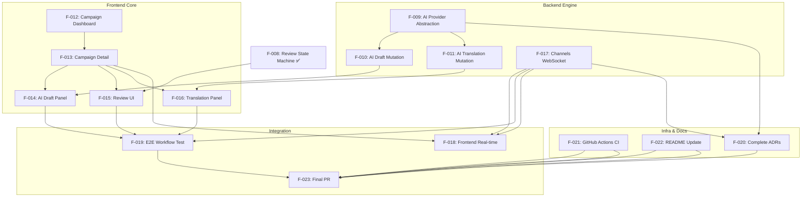

# Phase 2 Execution Plan — ACME Content Workflow

> **Status:** Planning complete | **Generated:** 2026-06-22
> **Scope:** Tasks F-009 through F-023 (remaining 15 tasks after F-000 through F-008 are DONE)
> **Estimated total effort:** ~11.5 hours (with 3 parallel tracks)

---

## 1. Dependency Graph



**Parallelism summary:**

| Track | Tasks | Parallel with | Merge point |
|---|---|---|---|
| **A: Backend Engine** | F-009 → F-010/F-011 → F-017 | Tracks B, C | After F-013 |
| **B: Frontend Core** | F-012 → F-013 → F-014/F-015/F-016 | Tracks A, C | After F-013/F-017 |
| **C: Infra & Docs** | F-021, F-022, F-020 | Tracks A, B | After F-019/F-020 |
| **D: Integration** | F-018 → F-019 → F-023 | Sequential (depends on everything) | Final |

---

## 2. Phase Breakdown & Optimal Ordering

### Phase 2a — Parallel Foundation (3 tasks, ~4h)
*All three tasks have zero dependencies and can run simultaneously.*

| Order | Task | Track | Est. | Why first |
|---|---|---|---|---|
| 1 | **F-009: AI Provider Abstraction** | A | 1h | Unlocks F-010, F-011, F-020 |
| 2 | **F-012: Campaign Dashboard** | B | 1h | Unlocks all frontend tasks |
| 3 | **F-017: Django Channels WebSocket** | A | 1h | Unlocks F-018, F-019, F-020 |
| 4 | **F-021: GitHub Actions CI** | C | 30m | Unlocks PR gating; parallel safe |
| 5 | **F-022: README Update** | C | 30m | No deps; can start immediately |

### Phase 2b — Dependent Backend (2 tasks, ~1.5h)
*Depends on F-009.*

| Order | Task | Track | Est. | Why |
|---|---|---|---|---|
| 6 | **F-010: AI Draft Generation Mutation** | A | 45m | Depends on F-009; unlocks F-014, F-019 |
| 7 | **F-011: AI Translation Mutation** | A | 45m | Depends on F-009; unlocks F-016, F-019 |

### Phase 2c — Frontend Detail + Feature Panels (4 tasks, ~3h)
*Depends on F-012.*

| Order | Task | Track | Est. | Why |
|---|---|---|---|---|
| 8 | **F-013: Campaign Detail Page** | B | 1h | Depends on F-012; unlocks all feature panels |
| 9 | **F-015: Review UI** | B | 30m | Depends on F-008 + F-013; F-008 done |
| 10 | **F-014: AI Draft Panel** | B | 45m | Depends on F-010 + F-013 |
| 11 | **F-016: Translation Panel** | B | 45m | Depends on F-011 + F-013 |

### Phase 2d — Real-Time Frontend (1 task, ~30m)
*Depends on F-017 + F-013.*

| Order | Task | Track | Est. |
|---|---|---|---|
| 12 | **F-018: Frontend Real-Time Updates** | D | 30m |

### Phase 2e — ADR Completion (1 task, ~30m)
*Depends on F-009 + F-017 (decisions now proven).*

| Order | Task | Track | Est. |
|---|---|---|---|
| 13 | **F-020: Complete Pending ADRs** | C | 30m |

### Phase 2f — Integration & Polish (2 tasks, ~1.5h)
*Depends on all backend + frontend features.*

| Order | Task | Track | Est. |
|---|---|---|---|
| 14 | **F-019: End-to-End Workflow Test** | D | 1h |
| 15 | **F-023: Final Smoke Test + PR** | D | 30m |

---

## 3. Parallel Execution Tracks — Detailed Schedule

### Track A: Backend Engine

```
Week 1                          Week 2
┌─────────┐   ┌─────────┐   ┌─────────┐
│ F-009   │   │ F-010   │   │ F-017   │
│ AI Abst │──>│ AI Draft│   │ Channels│
│ 1h      │   │ 45m     │   │ 1h      │
└─────────┘   ├─────────┤   └─────────┘
              │ F-011   │
              │ AI Trans│
              │ 45m     │
              └─────────┘
```

**Files to create/modify in F-009 (AI Provider Abstraction):**
- `backend/apps/ai/providers/__init__.py` — provider registry
- `backend/apps/ai/providers/base.py` — abstract base class (ABC) with `generate_draft()` and `translate()`
- `backend/apps/ai/providers/openai_provider.py` — OpenAI SDK implementation
- `backend/apps/ai/providers/anthropic_provider.py` — Anthropic SDK implementation
- `backend/apps/ai/prompts.py` — externalized prompt templates (draft + translation)
- `backend/apps/ai/services.py` — AI service with provider selection + fallback logic
- `backend/apps/ai/exceptions.py` — custom exceptions (ConfigurationError, AIProviderError, etc.)
- `backend/apps/ai/tests/test_ai_service.py` — mock-based tests
- `backend/config/schema.py` — Register AiMutation, AiQuery (already scaffolded, just wire in)

**Interface contract (F-009 outputs consumed by F-010, F-011):**
```python
# Expected interface for AiService
class AiService:
    @staticmethod
    def generate_draft(brief: str) -> DraftResult: ...
    @staticmethod
    def translate(text: str, target_language: str) -> TranslationResult: ...

# DraftResult = TypedDict with headline: str, description: str
# TranslationResult = TypedDict with headline: str, description: str
```

**Files to create/modify in F-010 (AI Draft Mutation):**
- `backend/apps/ai/schema.py` — add `generateDraft(contentId)` mutation
- `backend/apps/ai/services.py` or new mutation service — orchestrate AI call + state transition
- `backend/apps/ai/tests/test_ai_draft_mutation.py` — GraphQL mutation tests

**Files to create/modify in F-011 (AI Translation Mutation):**
- `backend/apps/ai/schema.py` — add `translateContent(contentId, targetLanguage)` mutation
- `backend/apps/ai/services.py` or new mutation service — orchestrate AI call + content creation
- `backend/apps/ai/tests/test_ai_translation_mutation.py` — GraphQL mutation tests

**Files to create/modify in F-017 (Django Channels WebSocket):**
- `backend/config/asgi.py` — update ProtocolTypeRouter with WebSocket consumers
- `backend/apps/reviews/consumers.py` — new WebSocket consumer for content state changes
- `backend/apps/reviews/routing.py` — new WebSocket URL routing
- `backend/apps/reviews/signals.py` — Django signals on state change → channel broadcast
- `backend/apps/reviews/tests/test_websocket.py` — Channels test communicator tests
- `backend/config/settings/base.py` — verify CHANNEL_LAYERS (InMemoryChannelLayer for dev)

### Track B: Frontend Core

```
Week 1                          Week 2
┌─────────┐   ┌─────────┐   ┌─────────────────┐
│ F-012   │   │ F-013   │   │ F-014 AI Draft  │
│ Dashboard│──>│ Detail  │   │ F-015 Review UI │
│ 1h      │   │ 1h      │   │ F-016 Translate │
└─────────┘   └─────────┘   │ 3× 45m each     │
                            └─────────────────┘
```

**Files to create/modify in F-012 (Campaign Dashboard):**
- `frontend/src/pages/DashboardPage.tsx` — main page component
- `frontend/src/components/CampaignList/CampaignList.tsx` — list component
- `frontend/src/services/api.ts` — already exists; add GraphQL query/mutation functions
- `frontend/src/hooks/useCampaigns.ts` — data fetching hook
- `frontend/src/App.tsx` — wire route `/` → DashboardPage
- `frontend/src/pages/DashboardPage.test.tsx` — component tests

**Files to create/modify in F-013 (Campaign Detail):**
- `frontend/src/pages/CampaignDetailPage.tsx` — detail page with content list
- `frontend/src/components/CampaignDetail/CampaignDetail.tsx` — detail view
- `frontend/src/components/ContentCard/ContentCard.tsx` — content piece card with state badge
- `frontend/src/hooks/useContentPieces.ts` — data fetching hook
- `frontend/src/App.tsx` — wire route `/campaigns/:id` → CampaignDetailPage
- `frontend/src/pages/CampaignDetailPage.test.tsx` — component tests

**Files to create/modify in F-014 (AI Draft Panel):**
- `frontend/src/components/AIDraftPanel/AIDraftPanel.tsx` — trigger/preview/accept-reject
- `frontend/src/components/AIDraftPanel/AIDraftPanel.test.tsx` — component tests

**Files to create/modify in F-015 (Review UI):**
- `frontend/src/components/ReviewActions/ReviewActions.tsx` — approve/reject/request edits buttons
- `frontend/src/components/ReviewActions/ReviewActions.test.tsx` — component tests

**Files to create/modify in F-016 (Translation Panel):**
- `frontend/src/components/TranslationPanel/TranslationPanel.tsx` — language selector + trigger
- `frontend/src/components/TranslationPanel/TranslationPanel.test.tsx` — component tests

### Track C: Infra & Docs

```
Week 1                          Week 2
┌─────────┐   ┌─────────┐   ┌─────────┐
│ F-021   │   │ F-022   │   │ F-020   │
│ CI      │   │ README  │   │ ADRs    │
│ 30m     │   │ 30m     │   │ 30m     │
└─────────┘   └─────────┘   └─────────┘
```

**F-021 (GitHub Actions CI):**
- `.github/workflows/ci.yml` — new file with 4 jobs: ruff, mypy, pytest, vitest
- Jobs run in parallel, each with `ubuntu-latest`
- Python setup with uv, Node setup with pnpm
- Docker build check job (optional, can add)

**F-022 (README Update):**
- `README.md` — comprehensive rewrite with:
  - Project description + core workflow diagram
  - Prerequisites (Python 3.12, Node 18, uv, Docker)
  - Quick start with Docker Compose
  - Manual development setup
  - Tech stack table with ADR links
  - GraphQL API overview (all mutations + queries)
  - Project structure
  - Available scripts
  - Environment variables reference

**F-020 (Complete ADRs):**
- `docs/adrs/ADR-002-ai-provider.md` — replace placeholder; document decision: **Both OpenAI + Anthropic with abstraction layer**
- `docs/adrs/ADR-003-real-time-mechanism.md` — replace placeholder; document decision: **Django Channels WebSockets** (since Channels already in deps + ASGI configured)
- Verify ADR-001, ADR-004, ADR-005, ADR-006 are current

### Track D: Integration

```
Week 2+                         
┌─────────┐   ┌─────────┐   ┌─────────┐
│ F-018   │   │ F-019   │   │ F-023   │
│ Frontend│──>│ E2E     │──>│ Final PR│
│ Realtime│   │ Test    │   │ 30m     │
│ 30m     │   │ 1h      │   └─────────┘
└─────────┘   └─────────┘
```

**F-018 (Frontend Real-Time Updates):**
- `frontend/src/services/websocket.ts` — full WebSocket client with reconnect
- `frontend/src/hooks/useWebSocket.ts` — React hook for connection lifecycle
- `frontend/src/components/RealtimeStatus/RealtimeStatus.tsx` — connection indicator + toast
- Add WebSocket integration to DashboardPage and CampaignDetailPage

**F-019 (E2E Workflow Test):**
- `backend/apps/ai/tests/test_e2e_workflow.py` — comprehensive integration test:
  - Create campaign → create content → generate draft → approve → translate
  - Verify state transitions at each step
  - Verify content piece creation after translation
  - Verify WebSocket broadcast (via Channels test communicator)
  - All AI calls mocked

**F-023 (Final Smoke Test + PR):**
- Manual verification checklist
- `docker compose up --build` verification
- `gh pr create` with `.github/PULL_REQUEST_TEMPLATE.md`

---

## 4. Subagent Gate Plan

Per AGENTS.md §7.4.3, each task type has a required review sequence. Below is the specific gate plan for every pending task.

### Backend Features

| Task | TDD Guide | Builder | DB Reviewer | Code Reviewer | Security Reviewer | Est. review time |
|---|---|---|---|---|---|---|
| **F-009** AI Provider Abstraction | ✅ Required | Writes code | ❌ No schema change | ✅ Required | ✅ Required (API keys!) | 15m |
| **F-010** AI Draft Mutation | ✅ Required | Writes code | ❌ No schema change | ✅ Required | ✅ Required (state transitions) | 15m |
| **F-011** AI Translation Mutation | ✅ Required | Writes code | ❌ No new schema | ✅ Required | ✅ Required | 15m |
| **F-017** Channels WebSocket | ✅ Required | Writes code | ❌ No schema change | ✅ Required | ✅ Required (WS security) | 20m |

### Frontend Features

| Task | Builder | TypeScript Reviewer | Code Reviewer | Est. review time |
|---|---|---|---|---|
| **F-012** Campaign Dashboard | Writes code | ✅ Required | ✅ Required | 15m |
| **F-013** Campaign Detail | Writes code | ✅ Required | ✅ Required | 15m |
| **F-014** AI Draft Panel | Writes code | ✅ Required | ✅ Required | 15m |
| **F-015** Review UI | Writes code | ✅ Required | ✅ Required | 10m |
| **F-016** Translation Panel | Writes code | ✅ Required | ✅ Required | 10m |
| **F-018** Frontend Real-time | Writes code | ✅ Required | ✅ Required | 15m |

### Infra Tasks

| Task | Builder | Code Reviewer | Security Reviewer | Est. review time |
|---|---|---|---|---|
| **F-021** GitHub Actions CI | Writes code | ✅ Required | ✅ Required | 10m |
| **F-023** Final Smoke + PR | Writes PR | ✅ Required | ✅ Required | 10m |

### Docs Tasks

| Task | Builder | Code Reviewer | Notes |
|---|---|---|---|
| **F-020** Complete ADRs | Writes docs | ✅ Required | No security review (no code) |
| **F-022** README Update | Writes docs | ✅ Required | No security review (no code) |

### Test Task

| Task | E2E Runner | Builder | Code Reviewer | Notes |
|---|---|---|---|---|
| **F-019** E2E Workflow Test | ✅ Required | Writes test | ✅ Required | Per AGENTS.md §7.4.3 |

**Note on TDD Guide:** Per AGENTS.md §7.4.1, `@nanlabs-tdd-guide` is required before implementing F-009, F-010, F-011, F-017. The guide should produce test stubs first, then the builder implements against them.

---

## 5. Risk Assessment

### High Risks

| # | Risk | Likelihood | Impact | Mitigation |
|---|---|---|---|---|
| R1 | **OpenAI/Anthropic SDK API drift** — SDK versions locked in pyproject.toml may have breaking changes | Low | High | Pin to specific minor versions. Write mock-based tests that don't depend on real API shapes. |
| R2 | **Django Channels + Daphne ASGI conflicts** — Already installed; WSGI (gunicorn) and ASGI (daphne) may conflict in Docker entrypoint | Medium | High | Verify Dockerfile CMD uses daphne for ASGI. Test `docker compose up` after F-017. |
| R3 | **Frontend WebSocket proxy** — nginx.conf in frontend Docker must proxy `/ws/` to backend; compose.yml may need adjustment | Medium | Medium | Already handled in F-006 Frontend Dockerfile (nginx.conf has `/ws/` proxy). Verify in F-018. |
| R4 | **Schema registration gaps** — Current `config/schema.py` only imports `CampaignMutations` and `ContentPieceMutations`. New mutations (review, AI) must be registered. | Medium | High | Builder must update `config/schema.py` in F-008, F-010, F-011 to register `AiMutation`, `ReviewMutation`, etc. |
| R5 | **Missing env vars for AI providers** — `.env.example` has keys but users may not set them | Low | Medium | Graceful fallback: if no API key, show clear error message in GraphQL response and disable AI features in frontend. |

### Medium Risks

| # | Risk | Likelihood | Impact | Mitigation |
|---|---|---|---|---|
| R6 | **Frontend test environment** — Vitest + jsdom may not support all features (e.g., WebSocket) | Low | Medium | Use `vi.mock()` for WebSocket in tests. Thread-safe mock for real-time. |
| R7 | **E2E test database isolation** — pytest-django with transactional DB may race with WebSocket state | Medium | Low | Use `pytest.mark.django_db(transaction=True)` for WebSocket tests. |
| R8 | **StateHistory migration** — F-008 said "state_history table" but reviews/models.py exists. Verify migration is applied. | Low | Medium | Check `python manage.py showmigrations reviews` for status. Run makemigrations if needed. |
| R9 | **ADR-002/003 content staleness** — Implementation decisions may differ from draft ADRs | Medium | Low | Complete ADRs AFTER implementation (F-009 and F-017 done) so they reflect reality. |

### Blast Radius Analysis

| Component | Failure Impact | Rollback |
|---|---|---|
| AI abstraction (F-009) | AI features disabled; CRUD + Review still work | Revert F-009, F-010, F-011 commits |
| WebSocket (F-017) | No real-time updates; page refresh still works | Revert F-017, F-018 commits |
| Frontend (F-012–F-016) | UI broken; API still works via curl/playground | Revert frontend commits |
| CI (F-021) | No CI enforcement; PR still mergable | Delete CI workflow file |

### Rollback Strategy

Each task is independently committable. If a task fails code review:
1. Fix issues in the same branch
2. Commit fixes with `fix(scope): ...` format
3. Re-run tests and re-request review
4. No need to roll back dependent tasks unless the interface contract changes

If an interface contract changes (e.g., `AiService.generate_draft()` signature changes):
1. Update the provider that exposes the contract (F-009)
2. Update all consumers (F-010, F-011) in the same PR
3. This is why F-009, F-010, F-011 should either be one branch (sequential) or use strict interface-first TDD

---

## 6. Estimated Effort Summary

| Phase | Tasks | Backend | Frontend | Infra | Docs | Test | Total |
|---|---|---|---|---|---|---|---|
| 2a: Foundation | F-009, F-012, F-017, F-021, F-022 | 2h | 1h | 30m | 30m | — | **4h** |
| 2b: Backend AI | F-010, F-011 | 1.5h | — | — | — | — | **1.5h** |
| 2c: Frontend Detail | F-013, F-014, F-015, F-016 | — | 3h | — | — | — | **3h** |
| 2d: Real-time | F-018 | — | 30m | — | — | — | **30m** |
| 2e: Docs | F-020 | — | — | — | 30m | — | **30m** |
| 2f: Integration | F-019, F-023 | — | — | 30m | — | 1h | **1.5h** |
| **Total** | **15 tasks** | **3.5h** | **4.5h** | **1h** | **1h** | **1h** | **~11.5h** |

**Realistic calendar estimate:** ~3–4 days with one developer using agents in parallel.

---

## 7. First Actionable Step: Detailed Breakdown

### Recommended Starting Point: F-009 (AI Provider Abstraction)

**Why start here:** F-009 unlocks both F-010 (draft) and F-011 (translation), has zero dependencies, and can be tested in isolation. It is also required before ADR-002 can be completed.

**Files to create:**

#### 7.1 Interface definition — `backend/apps/ai/providers/base.py`

```python
from abc import ABC, abstractmethod
from dataclasses import dataclass

@dataclass
class DraftResult:
    headline: str
    description: str

@dataclass
class TranslationResult:
    headline: str
    description: str

class AIProvider(ABC):
    @abstractmethod
    def generate_draft(self, brief: str) -> DraftResult: ...

    @abstractmethod
    def translate(self, text: str, target_language: str) -> TranslationResult: ...
```

#### 7.2 OpenAI provider — `backend/apps/ai/providers/openai_provider.py`

```python
from openai import OpenAI
from apps.ai.providers.base import AIProvider, DraftResult, TranslationResult

class OpenAIProvider(AIProvider):
    def __init__(self, api_key: str, model: str = "gpt-4o", temperature: float = 0.7, max_tokens: int = 2048):
        self.client = OpenAI(api_key=api_key)
        self.model = model
        self.temperature = temperature
        self.max_tokens = max_tokens

    def generate_draft(self, brief: str) -> DraftResult:
        # Call OpenAI chat completions
        # Parse structured JSON response
        # Return DraftResult
        ...

    def translate(self, text: str, target_language: str) -> TranslationResult:
        # Call OpenAI with translation prompt
        # Parse response
        # Return TranslationResult
        ...
```

#### 7.3 Anthropic provider — `backend/apps/ai/providers/anthropic_provider.py`

```python
from anthropic import Anthropic
from apps.ai.providers.base import AIProvider, DraftResult, TranslationResult

class AnthropicProvider(AIProvider):
    def __init__(self, api_key: str, model: str = "claude-sonnet-4-20250514", temperature: float = 0.7, max_tokens: int = 2048):
        self.client = Anthropic(api_key=api_key)
        self.model = model
        self.temperature = temperature
        self.max_tokens = max_tokens

    def generate_draft(self, brief: str) -> DraftResult: ...
    def translate(self, text: str, target_language: str) -> TranslationResult: ...
```

#### 7.4 Provider registry — `backend/apps/ai/providers/__init__.py`

```python
from django.conf import settings
from apps.ai.providers.base import AIProvider
from apps.ai.exceptions import ConfigurationError

def get_provider() -> AIProvider:
    provider_name = settings.AI_PROVIDER  # "openai" or "anthropic"
    if provider_name == "openai":
        if not settings.OPENAI_API_KEY:
            raise ConfigurationError("OPENAI_API_KEY not configured")
        return OpenAIProvider(
            api_key=settings.OPENAI_API_KEY,
            model=settings.OPENAI_MODEL,
            temperature=settings.AI_TEMPERATURE,
            max_tokens=settings.AI_MAX_TOKENS,
        )
    elif provider_name == "anthropic":
        if not settings.ANTHROPIC_API_KEY:
            raise ConfigurationError("ANTHROPIC_API_KEY not configured")
        return AnthropicProvider(...)
    raise ConfigurationError(f"Unknown AI provider: {provider_name}")
```

#### 7.5 Prompt templates — `backend/apps/ai/prompts.py`

```python
DRAFT_PROMPT = """You are a content creation assistant. Based on the following brief, generate a compelling headline and description.

Brief: {brief}

Respond with valid JSON in this format:
{{"headline": "...", "description": "..."}}

Ensure the headline is attention-grabbing and under 100 characters.
The description should be 2-3 sentences that expand on the headline."""

TRANSLATION_PROMPT = """You are a professional translator. Translate the following content to {target_language}.

Headline: {headline}
Description: {description}

Respond with valid JSON in this format:
{{"headline": "...", "description": "..."}}

Preserve the tone and style of the original."""
```

#### 7.6 Service layer — `backend/apps/ai/services.py`

```python
from apps.ai.providers import get_provider
from apps.ai.providers.base import DraftResult, TranslationResult
import logging

logger = logging.getLogger(__name__)

class AiService:
    @staticmethod
    def generate_draft(brief: str) -> DraftResult:
        provider = get_provider()
        try:
            return provider.generate_draft(brief)
        except Exception as e:
            logger.error(f"Primary AI provider failed: {e}")
            # Fallback to other provider
            fallback = get_provider()  # Swap AI_PROVIDER setting
            return fallback.generate_draft(brief)

    @staticmethod
    def translate(text: str, target_language: str) -> TranslationResult:
        ...
```

#### 7.7 Custom exceptions — `backend/apps/ai/exceptions.py`

```python
class AIProviderError(Exception):
    """Base exception for AI provider failures."""

class ConfigurationError(AIProviderError):
    """Raised when AI provider is not properly configured."""

class RateLimitError(AIProviderError):
    """Raised when API rate limit is exceeded."""

class MalformedResponseError(AIProviderError):
    """Raised when AI provider returns unexpected format."""
```

#### 7.8 Test stubs (TDD Guide output) — `backend/apps/ai/tests/test_ai_service.py`

```python
import pytest
from unittest.mock import patch, MagicMock
from apps.ai.services import AiService
from apps.ai.exceptions import ConfigurationError

class TestAiService:
    def test_generate_draft_with_openai(self):
        """Mock OpenAI and verify DraftResult is returned."""
        ...

    def test_generate_draft_with_anthropic(self):
        """Mock Anthropic and verify DraftResult is returned."""
        ...

    def test_fallback_on_rate_limit(self):
        """Primary provider fails, fallback succeeds."""
        ...

    def test_no_api_key_raises_error(self):
        """Both providers unconfigured → ConfigurationError."""
        ...

    def test_malformed_response_raises_error(self):
        """AI returns non-JSON → MalformedResponseError."""
        ...
```

#### 7.9 Existing files to modify

- `backend/apps/ai/models.py` — can remain empty (no DB models needed for abstraction)
- `backend/apps/ai/schema.py` — add stubs for future AI mutations (will be populated in F-010/F-011)
- `backend/config/schema.py` — register `AiQuery` + `AiMutation` if they have content

#### 7.10 Documentation to update (in same commit)

- `README.md` — add AI Provider Configuration section (`AI_PROVIDER`, model names, env vars)
- `docs/architecture.md` — update component diagram to include AI service abstraction layer

---

## 8. Interface Contracts Between Modules

### Contract Map

| Provider | Consumer(s) | Contract | Breaking change risk |
|---|---|---|---|
| `AiService.generate_draft(brief)` | F-010 schema mutation | Returns `DraftResult` (headline, description) | High — changing return type breaks F-010 |
| `AiService.translate(text, lang)` | F-011 schema mutation | Returns `TranslationResult` (headline, description) | High — changing return type breaks F-011 |
| `ReviewService.review_content(id, action, feedback)` | F-014, F-015 frontend | Existing implementation in F-008 | Low — already tested |
| `ReviewService.edit_content(id, headline, desc, body)` | F-014, F-015 frontend | Existing implementation in F-008 | Low — already tested |
| `ContentPieceService.create_content_piece(...)` | F-011 translation mutation | Returns `ContentPiece` model | Medium — adding required fields breaks |
| Channels WebSocket event payload | F-018 frontend | `{contentId, campaignId, oldState, newState, timestamp, action}` | High — frontend parses this shape |
| GraphQL schema `generateDraft` | F-014 frontend | `mutation generateDraft(contentId: ID!) { ... }` | High — mutation name/params change |
| GraphQL schema `translateContent` | F-016 frontend | `mutation translateContent(contentId: ID!, targetLanguage: String!) { ... }` | High — mutation name/params change |
| GraphQL schema `reviewContent` | F-015 frontend | `mutation reviewContent(contentId: ID!, action: ReviewAction!, feedback: String) { ... }` | Low — already defined |
| GraphQL schema `campaign(id)` | F-013 frontend | `query campaign(id: ID!) { id, name, contentPieces { ... } }` | Low — already defined |

### Contract-First Recommendation

To mitigate breaking-change risks:
1. **Implement F-009 completely before starting F-010 or F-011.** Do not parallelize F-010/F-011 with F-009.
2. **Write integration tests in F-010/F-011** that call `AiService` through the public API (not mocks of private methods).
3. **Freeze the WebSocket event payload schema** in F-017 before F-018 starts. Document it in `docs/architecture.md` or `agentic/knowledge/decisions/`.
4. **Frontend feature tasks (F-014, F-015, F-016)** should use GraphQL codegen or manually typed operations that match the backend exactly. The `frontend/src/types/` directory should mirror the GraphQL schema types.

---

## 9. Pre-Flight Checklist for F-009

Before starting F-009, verify:

- [ ] `OPENAI_API_KEY` and `ANTHROPIC_API_KEY` exist in `.env.example` (yes — §4.3)
- [ ] `AI_PROVIDER`, `OPENAI_MODEL`, `ANTHROPIC_MODEL`, `AI_TEMPERATURE`, `AI_MAX_TOKENS` exist in Django settings base.py (yes — lines 14–20)
- [ ] `openai` and `anthropic` Python packages are in pyproject.toml dependencies (yes — lines 14-15)
- [ ] `uv sync` installs both packages without error
- [ ] `backend/apps/ai/` directory exists with `__init__.py`, `models.py`, `schema.py` (yes — all scaffolded)
- [ ] `backend/apps/ai/tests/` directory exists with `__init__.py` (yes)
- [ ] No existing AI provider code needs to be removed (AI app is empty stubs)
- [ ] mypy passes on current codebase (base check before adding new files)

---

## Appendix A: Task Execution Command Reference

```bash
# === Phase 2a: Parallel Foundation ===

# F-009: AI Provider Abstraction
git checkout -b feat/ai-provider-abstraction
# Create files: providers/base.py, openai_provider.py, anthropic_provider.py, __init__.py
# Create files: prompts.py, services.py, exceptions.py
# Create tests: test_ai_service.py
# Update: config/schema.py (register AiQuery+AiMutation)
git add -A && git commit -m "feat(ai): add AI provider abstraction layer with OpenAI and Anthropic"
git push -u origin feat/ai-provider-abstraction
gh pr create --draft --title "feat: AI provider abstraction layer" --body-file .github/PULL_REQUEST_TEMPLATE.md

# F-012: Campaign Dashboard
git checkout -b feat/campaign-dashboard
# Create files: pages/DashboardPage.tsx, components/CampaignList/CampaignList.tsx
# Create files: hooks/useCampaigns.ts
# Update: App.tsx (add / route), services/api.ts (add GraphQL functions)
git add -A && git commit -m "feat(frontend): add Campaign Dashboard page with list and create"
git push -u origin feat/campaign-dashboard

# F-017: Django Channels WebSocket
git checkout -b feat/channels-websocket
# Create files: consumers.py, routing.py, signals.py
# Update: asgi.py (ProtocolTypeRouter)
# Create tests: test_websocket.py
git add -A && git commit -m "feat(realtime): add Django Channels WebSocket with state change broadcasts"
git push -u origin feat/channels-websocket

# === Test commands ===
cd backend && uv run pytest apps/ai/tests/ -v           # AI tests
cd backend && uv run pytest apps/reviews/tests/ -v      # Reviews/WS tests
cd frontend && pnpm test                                 # Frontend tests
cd backend && uv run mypy apps/                          # Type check
cd backend && uv run ruff check apps/                    # Lint
```

---

*This plan document is the execution roadmap for Phase 2 of the ACME Content Workflow challenge. It supersedes any earlier ad-hoc planning and should be consulted before starting each task. Update `agentic/tasks/session-progress.md` after each task completion with a 1-2 line summary pointing to this plan document and the task's handoff directory.*
