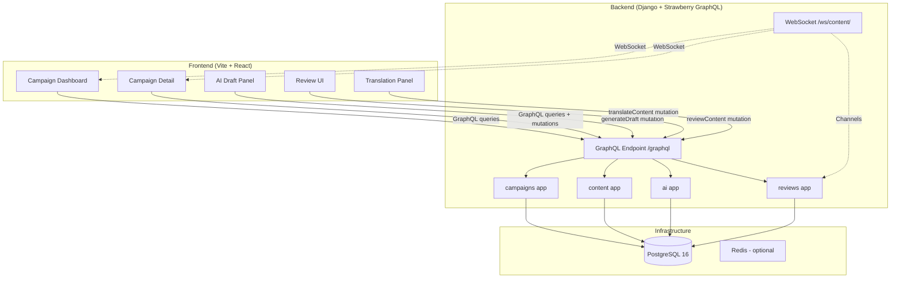

# Architecture Review Report

**Date:** 2026-06-18 (updated 2026-06-19 — F-008 state machine now implemented)
**Project:** ACME GLOBAL MEDIA — AI Content Workflow Platform
**Review Type:** Mid-implementation architecture alignment (F-002 complete, F-003 onwards pending)
**Reviewer:** @tech-lead

---

## Table of Contents

1. [Executive Summary](#1-executive-summary)
2. [Architecture Alignment Check](#2-architecture-alignment-check)
3. [Backend Architecture Assessment](#3-backend-architecture-assessment)
4. [Frontend Architecture Assessment](#4-frontend-architecture-assessment)
5. [Infrastructure Assessment](#5-infrastructure-assessment)
6. [Remaining Tasks Validation](#6-remaining-tasks-validation)
7. [ADR Review](#7-adr-review)
8. [Top 3 Architectural Risks](#8-top-3-architectural-risks)
9. [Recommended Remediations](#9-recommended-remediations)
10. [Updated Task Dependency Graph](#10-updated-task-dependency-graph)

---

## 1. Executive Summary

**Overall assessment: The backend foundation is well-structured but has several gaps that must be addressed before proceeding with Phases 1-4.** The Django + Strawberry GraphQL stack is properly scaffolded, settings are cleanly split, and the app structure follows Django conventions. However, critical integration points (CORS, Dockerfile entrypoint, frontend stack) are either missing or misconfigured from the NestJS-era remnants.

### Compliance with Non-Negotiable Rules

| Rule | Status | Notes |
|---|---|---|
| R-001: Django + Strawberry GraphQL | ✅ | Properly scaffolded. 4 apps, ASGI configured, GraphQL schema at `/graphql` |
| R-002: React (Vite) | ⚠️ | Vite exists but `frontend/` needs clean restart — missing Zustand, Tailwind, GraphQL client |
| R-003: PostgreSQL | ✅ | PostgreSQL 16-alpine in `compose.yml` with healthcheck |
| R-004: Docker Compose one command | ❌ | Frontend service commented out in `compose.yml`; `docker compose up` does not start full stack |
| R-005: OpenAI/Anthropic SDK | ✅ | Dependencies installed (`openai>=1.55`, `anthropic>=0.49`); integration code pending |
| R-006: State machine | ✅ | Transition guards implemented, 32 tests, all valid/invalid transitions enforced |
| R-007: No hardcoded secrets | ✅ | All keys via `env_file` + `django-environ` |
| R-008: Every endpoint has a test | ⚠️ | No tests written yet (F-003+ not started) |
| R-009: AI integration mock tests | ⚠️ | Test planned but not written yet |
| R-010: Strict type hints | ✅ | `mypy` configured in strict mode |
| R-011: No `Any` types | ⚠️ | Enforced by mypy, but no code written yet to verify |
| R-012: Explicit error handling | ⚠️ | Pending |
| R-013: Conventional commits | ✅ | Observed in session-progress.md |
| R-014: No `print()` in production | ✅ | Base settings use `DEBUG` flag, no `print()` found in scaffold code |
| R-015: ADRs exist | ✅ | 6 ADRs created; ADR-004 needs completion |
| R-020: Feature branches | ⚠️ | No evidence of current branch usage |
| R-022: `.env.example` committed | ✅ | At root, with comprehensive vars |
| R-023: `compose.yml` works | ⚠️ | `docker compose up` starts DB + backend but not frontend |

---

## 2. Architecture Alignment Check

### 2.1 Core Workflow Support

```
User creates Campaign
  └─> User adds Content Pieces (with brief)
       └─> Agent generates AI Draft (OpenAI / Anthropic)
            ├─> Human reviews draft → Approve / Edit / Reject
            └─> Human requests Translation → AI translates → Human reviews
```

**Assessment:** The 4 Django apps (campaigns, content, ai, reviews) correctly map to this workflow. No app is missing, no app is redundant. The model relationships (Campaign → ContentPiece → self-referential `original` for translations) support the full flow.

### 2.2 State Machine Alignment

```
[Draft] ──generate AI──> [Suggested by AI]
                              │
                   ┌──────────┼──────────┐
                   ▼          ▼          ▼
              [Reviewed]  [Edited]   [Rejected]
                   │
                   ▼
             [Approved]
```

**Assessment:** The `ContentPiece.State.TextChoices` in `backend/apps/content/models.py` defines all 5 states correctly. However, the state machine **transition guards** are not implemented — this is planned for F-009. The state machine as defined in AGENTS.md Appendix D includes an `EDITED` state that isn't in the model enum. **This is a discrepancy** — the model has `DRAFT, SUGGESTED_BY_AI, REVIEWED, APPROVED, REJECTED` but the state machine diagram shows `[Edited]` as a separate state. The flow diagram `[Draft] → [Suggested by AI] → [Reviewed] → [Approved]` in AGENTS.md section 1 is the canonical truth.

**Recommendation:** Clarify whether "Edited" is a state or a transition action. The current model treats it as a transition back to `DRAFT` (user edits rejected content → state resets to `DRAFT`), which is reasonable.

### 2.3 Architecture Diagram



---

## 3. Backend Architecture Assessment

### 3.1 Strengths

1. **Clean settings split** — `base.py` / `development.py` / `production.py` with `django-environ`. Production has security headers (HSTS, CSP, CSRF) and a `SECRET_KEY` guard.

2. **Correct app decomposition** — 4 Django apps with clear separation of concerns:
   - `campaigns`: Campaign CRUD
   - `content`: ContentPiece CRUD + state management
   - `ai`: AI provider abstraction + generation/translation
   - `reviews`: Review workflow mutations

3. **ASGI configured for Channels** — `config/asgi.py` has `ProtocolTypeRouter` with `URLRouter([])` placeholder, ready for WebSocket routing.

4. **Model design** — UUID primary keys, proper foreign keys, soft-delete pattern via `is_deleted` with index, self-referential `original` FK for translations.

5. **Dependency management** — uv with lockfile, clean `pyproject.toml` with pinned ranges.

### 3.2 Gaps & Risks

#### Gap 1: Missing `django-cors-headers` (CRITICAL)

The frontend runs on `localhost:5173` and the backend on `localhost:8000`. Without CORS headers, all GraphQL requests from the browser will be blocked. The Strawberry GraphQL playground works (same-origin) but frontend API calls will fail.

**Fix:** Add `django-cors-headers` to dependencies, add to `INSTALLED_APPS` and `MIDDLEWARE`, configure `CORS_ALLOWED_ORIGINS` from `FRONTEND_URL` env var.

#### Gap 2: Dockerfile uses WSGI, not ASGI

```dockerfile
CMD ["gunicorn", "config.wsgi:application", "--bind", "0.0.0.0:8000", "--workers", "4", "--worker-class", "uvicorn.workers.UvicornWorker"]
```

This uses the WSGI application with a Uvicorn worker. While this works for HTTP requests, it **does not support WebSockets** (Django Channels). Since we need WebSocket support for real-time updates, the production entrypoint must use the ASGI application:

```dockerfile
CMD ["daphne", "-b", "0.0.0.0", "-p", "8000", "config.asgi:application"]
```

Or use `uvicorn` with the ASGI app directly. The current setup will start but WebSockets won't work in production.

#### Gap 3: No migrations in Dockerfile or compose lifecycle

The Dockerfile doesn't run `python manage.py migrate` or `python manage.py collectstatic`. Migrations need to run at startup (via a startup script or entrypoint) or as a separate `docker compose run` step. The current `compose.yml` has no `entrypoint` override to handle this.

#### Gap 4: Incomplete schema.py files

- `backend/config/schema.py` — only has `health` query and `ping` mutation (placeholders)
- `backend/apps/campaigns/schema.py` — defines `Campaign` GraphQL type but without any queries or mutations
- Other app `schema.py` files exist (`content`, `ai`, `reviews`) but their content hasn't been reviewed

The root schema needs to import and merge types from all apps. The `STRAWBERRY_GRAPHQL` setting references `config.schema.schema`, but this schema doesn't include any app-specific types yet.

#### Gap 5: `init.sh` is stale (NestJS-era)

The `init.sh` at the repo root is a generic script from the NestJS era. It:
- Doesn't check for Python ≥3.12 or uv
- Has fallback logic for package.json / requirements.txt / go.mod
- References `drizzle-kit` and `alembic` instead of Django's `manage.py migrate`
- Points to `localhost:3000` for backend (should be `:8000`)
- Doesn't set up a `.venv` for Python

This needs a complete rewrite to match the spec in AGENTS.md section 4.2.

#### Gap 6: No `uv.lock` committed

The `pyproject.toml` is present but I didn't confirm `uv.lock` exists. If missing, installs will not be reproducible.

---

## 4. Frontend Architecture Assessment

### 4.1 Current State

The `frontend/` directory exists from the previous NestJS-era scaffold. It has:
- React 19 + React Router 7 + Vite 6 (correct versions)
- axios (but no GraphQL client)
- Vitest + React Testing Library configured
- TypeScript configured
- Empty scaffold structure (`components/`, `hooks/`, `pages/`, `services/`, `types/`)

### 4.2 Gaps Relative to Human Decisions

| Decision | Status | Action Required |
|---|---|---|
| Vite (H-003) | ✅ Already Vite 6 | None |
| Zustand (H-013) | ❌ Not installed | Add `zustand` to dependencies |
| Tailwind CSS (H-014) | ❌ Not installed | Add `tailwindcss`, `postcss`, `autoprefixer` |
| GraphQL Client | ❌ Missing | Add `@apollo/client` or `urql` |
| WebSocket Client | ❌ Missing | Add WebSocket client for Django Channels |

### 4.3 Critical Configuration Issues

1. **Vite proxy targets wrong port** — `vite.config.ts` proxies `/api` to `http://localhost:3000` (old NestJS). Should be `http://localhost:8000` for Django. Also, since we're using GraphQL (not REST `/api` paths), the proxy should route `/graphql` to the backend.

2. **Missing `FRONTEND_URL` env var usage** — The frontend needs to know the backend GraphQL URL, typically via `VITE_API_URL` environment variable.

3. **No Tailwind CSS setup** — No `postcss.config.js` or `tailwind.config.js`, no `@tailwind` directives in CSS.

### 4.4 Recommendation: Restructure F-013

The current F-013 ("React project scaffold") needs to be split or expanded to include:
1. Install Zustand + Tailwind CSS + GraphQL client (Apollo Client recommended)
2. Configure Vite proxy for Django (`localhost:8000`)
3. Set up Tailwind CSS (config files, CSS imports)
4. Create Zustand stores (campaigns, content, ui)
5. Create Apollo Client instance with error handling
6. Create WebSocket service stub

---

## 5. Infrastructure Assessment

### 5.1 Docker Compose

**Current state:** `compose.yml` has PostgreSQL (with healthcheck) + Django backend. Frontend is commented out.

**Issues:**
1. **Frontend service commented out** — `docker compose up` doesn't start the full stack (violates R-004)
2. **No port mapping on backend** — The backend service doesn't have `ports:` so it's not accessible from the host. The compose spec in AGENTS.md implies port 8000 should be exposed.
3. **No Redis service** — While InMemoryChannelLayer works for dev, Channels in production will need Redis. The compose.yml should include a Redis service (even if optional) for when Channels needs it.
4. **No migration step** — No `entrypoint` or startup script to run `python manage.py migrate` before the backend starts accepting connections.

### 5.2 Dockerfile (Backend)

**Issues:**
1. **WSGI vs ASGI** — As noted in section 3.2 (Gap 2), the CMD uses WSGI but we need ASGI for WebSocket support.
2. **No `collectstatic` step** — Static files won't be collected in the production image.
3. **`uv sync --no-dev --frozen` before `COPY . .`** — This is correct for layer caching but the `--frozen` flag will fail if there's no `uv.lock`. Need to verify `uv.lock` is committed.

### 5.3 GitHub Actions CI

The CI workflow exists at `.github/workflows/ci.yml` but hasn't been reviewed for content. This is a Phase 5 task (F-022) and is out of scope for immediate concerns.

---

## 6. Remaining Tasks Validation

### 6.1 Task vs Reality Mapping

| ID | Title | Status in JSON | Actual Status | Gap |
|---|---|---|---|---|
| F-000 | Initialize monorepo | done | done | ✅ |
| F-001 | Clean up NestJS artifacts | pending | done (not tracked) | ⚠️ Task status says pending but work is complete |
| F-002 | Install Django stack | done | done | ✅ |
| F-003 | Campaign CRUD GraphQL API | pending | pending | ✅ Correct |
| F-004 | Content Piece CRUD | pending | pending | ✅ Correct |
| F-005 | PostgreSQL schema & migrations | pending | pending | ⚠️ Partially done (models exist in code) |
| F-006 | AI abstraction layer | pending | pending | ✅ Correct |
| F-007 | AI draft mutation | pending | pending | ✅ Correct |
| F-008 | AI translation mutation | pending | pending | ✅ Correct |
| F-009 | State machine | pending | pending | ✅ Correct |
| F-010 | Review mutations | pending | pending | ✅ Correct |
| F-011 | WebSocket setup | pending | pending | ⚠️ ASGI placeholder exists |
| F-012 | Real-time broadcast | pending | pending | ✅ Correct |
| F-013 | React scaffold | pending | pending | ❌ Needs scope expansion |
| F-014 | Campaign Dashboard | pending | pending | ✅ Correct |
| F-015 | Campaign Detail | pending | pending | ✅ Correct |
| F-016 | AI Draft panel | pending | pending | ✅ Correct |
| F-017 | Review UI | pending | pending | ✅ Correct |
| F-018 | Translation panel | pending | pending | ✅ Correct |
| F-019 | Real-time frontend | pending | pending | ✅ Correct |
| F-020 | Docker Compose | pending | pending | ⚠️ Partially done (needs frontend + Redis) |
| F-021 | Dockerfiles | pending | pending | ⚠️ Backend Dockerfile exists but needs ASGI fix |
| F-022 | GitHub Actions CI | pending | pending | ⚠️ `ci.yml` exists but content unknown |
| F-023 | E2E test | pending | pending | ✅ Correct |
| F-024 | ADRs | pending | pending | ⚠️ ADRs exist but ADR-004 incomplete |
| F-025 | README update | pending | pending | ⚠️ README is original challenge, needs rewrite |
| F-026 | Final smoke test | pending | pending | ✅ Correct |
| F-027 | Architecture replanning | done | done | ✅ |

### 6.2 Issues with Task Structure

#### Issue 1: F-001 status desync (status: pending, but work is done)

F-001 "Clean up old NestJS/TypeScript backend artifacts" is marked `pending` in the JSON but the work is complete (NestJS source has been removed, Django scaffold is in place). Session-progress.md also marks it as DONE. **The JSON needs updating.**

#### Issue 2: F-003 and F-005 overlap (scope conflict)

**F-003:** "Campaign CRUD GraphQL API" — includes creating the Campaign model, migrations, GraphQL queries/mutations.
**F-005:** "PostgreSQL schema & Django migrations" — includes creating both Campaign and ContentPiece models + migrations.

These two tasks have **significant scope overlap**. F-005's description says "Create Django models, database enums, indices, and migration files" but the models already exist in code from F-002's scaffold (see `campaigns/models.py` and `content/models.py`). 

**Recommendation:** Merge F-005 into F-003 and F-004. Remove F-005 as a standalone task. The migrations will naturally be created when implementing F-003 (Campaign model needs a migration) and F-004 (ContentPiece model needs a migration).

#### Issue 3: Missing frontend infrastructure tasks

No tasks exist for:
- Installing Tailwind CSS + configuration
- Installing Zustand + creating stores
- Installing Apollo Client (or URQL) + configuration
- Updating Vite proxy config

These should be added as sub-tasks of F-013 or as separate F-XXX tasks.

#### Issue 4: Missing CORS task

No task explicitly addresses adding `django-cors-headers`. This is a cross-cutting concern needed before any frontend-backend communication works. Should be added as part of F-003 or as a standalone infra task.

#### Issue 5: ADR-004 needs pre-implementation completion

ADR-004 (Database Schema) is marked "Proposed" with placeholder sections. The schema tables are filled in but the decision text, consequences, and alternatives are "To be filled." Since R-015 requires ADRs as part of the submission, this ADR needs to be completed **before** or during F-003/F-004 implementation, not left until F-024 (which is last).

#### Issue 6: ADR task dependencies are wrong

F-024 (ADRs) lists its dependencies as `[F-003, F-006, F-011, F-005]`. This means ADRs can only start after the AI provider abstraction, WebSocket setup, and database schema are all implemented. But ADRs should document **design decisions made before implementation**, not after. **ADR-004 (DB Schema) should be written before F-003, not after.**

**Recommendation:** Move ADR writing to the beginning of each phase — ADR-001/ADR-004 before Phase 0, ADR-002 before Phase 1, ADR-003 before Phase 3. Remove F-024 as a batch task.

### 6.3 Missing Tasks

| Missing Task | Where it Should Fit | Rationale |
|---|---|---|
| **CORS configuration** | Between F-002 and F-013 | Frontend can't call backend without CORS |
| **Tailwind CSS setup** | Part of F-013 | Human decision H-014 |
| **Zustand setup + stores** | Part of F-013 | Human decision H-013 |
| **GraphQL client setup** | Part of F-013 | Required for all frontend features |
| **WebSocket client service** | Part of F-013 | Required for F-019 |
| **Init.sh rewrite** | F-002 or new F-XXX | Current init.sh is NestJS-era |

### 6.4 Task Ordering Recommendations

The current ordering is close to correct, but with these adjustments:

1. **F-003** (Campaign CRUD) → includes creating Campaign model migrations
2. **CORS task** (new) → add `django-cors-headers`, configure with `FRONTEND_URL`
3. **F-004** (Content Piece CRUD) → includes ContentPiece model migrations
4. **F-009** (State machine) → can be done standalone since ContentPiece model exists
5. **F-006** (AI abstraction) → no hard deps on F-003/F-004, can start after F-002
6. **F-013** (React scaffold) → needs scope expansion for Zustand/Tailwind/GraphQL client
7. **Update init.sh** → should be done before F-013 (frontend devs need it)
8. **F-020** (Docker Compose) → needs frontend service added, not just DB+backend
9. **ADRs** → write phase-by-phase, not as a final batch task

---

## 7. ADR Review

### 7.1 ADR Inventory

| ADR | Title | Status | Completeness |
|---|---|---|---|
| ADR-001 | REST vs GraphQL | Accepted (superseded by ADR-005) | ✅ Complete |
| ADR-002 | AI Provider Selection | Accepted | ⚠️ Needs verification |
| ADR-003 | Real-Time Mechanism | Accepted | ⚠️ Needs verification |
| ADR-004 | Database Schema | Proposed | ❌ Incomplete (decision not yet filled) |
| ADR-005 | Django + Strawberry GraphQL Architecture | Accepted | ✅ Complete |
| ADR-006 | Agentic Directory Structure | Accepted | ✅ Complete |

### 7.2 Assessment

**What's good:** 6 ADRs exist, covering the required decisions (REST vs GraphQL, AI provider, real-time, DB schema). The ADRs follow the template from AGENTS.md section 10.2.

**What's missing:**
1. **ADR-004 is incomplete** — The "Decision" section still says "[To be filled during implementation]" and the "Consequences: Positive/Negative" sections are placeholders. This must be completed with actual rationale.
2. **ADR-004 should be completed now** — The schema is largely finalized (Campaign + ContentPiece models exist), so the ADR can and should be completed before F-003/F-004 start.
3. **ADR-002 and ADR-003 completeness unknown** — I haven't read them, but they need to fully document the tradeoffs for "both providers" and "Django Channels" decisions.
4. **ADR-005 exists** — This documents the NestJS → Django migration decision, which is good context for the evaluator.

---

## 8. Top 3 Architectural Risks

### Risk 1: CORS + WSGI + Docker gaps will block integration testing (HIGH)

**Description:** Three independent issues will each cause a "broken integration" failure:
1. No CORS headers → frontend can't call backend from browser
2. WSGI entrypoint in Dockerfile → WebSockets won't work in production
3. No port mapping on backend service → backend not accessible from host in Docker

**Impact:** When the frontend (F-013) is implemented, the developer won't be able to connect it to the backend. This could waste hours of debugging.

**Mitigation:** Fix all three before starting F-013:
- Add `django-cors-headers` to F-003
- Fix Dockerfile CMD to use ASGI (`daphne` or `uvicorn config.asgi:application`)
- Add `ports: ["8000:8000"]` to backend service in `compose.yml`

### Risk 2: Frontend scaffold has wrong proxy target and missing dependencies (MEDIUM)

**Description:** The `frontend/` directory is a NestJS-era artifact with:
- Vite proxy targeting `localhost:3000` (old NestJS)
- No GraphQL client, no Zustand, no Tailwind
- Stale `init.sh` that doesn't set up the frontend correctly

**Impact:** Developer time wasted debugging proxy issues, missing dependencies, or using the wrong stack components.

**Mitigation:** Before F-013, do a frontend cleanup task:
1. Update `vite.config.ts` proxy to target `localhost:8000` for `/graphql`
2. Add `zustand`, `tailwindcss`, `@apollo/client` (or `urql`), `graphql` to `package.json`
3. Configure Tailwind CSS (config files + CSS import)
4. Rewrite `init.sh` to match AGENTS.md spec

### Risk 3: State machine mismatch between AGENTS.md and model (MEDIUM)

**Description:** There's a discrepancy between:
- AGENTS.md Appendix D: Shows `EDITED` as a state, transitions include `REVIEWED → SUGGESTED_BY_AI`
- `ContentPiece.State` model: Has `REVIEWED` but no `EDITED` state

The AGENTS.md state machine shows:
```
[Draft] ──generate AI──> [Suggested by AI]
                              │
                   ┌──────────┼──────────┐
                   ▼          ▼          ▼
              [Reviewed]  [Edited]   [Rejected]
                   │
                   ▼
             [Approved]
```

With transitions:
```
REVIEWED → [APPROVED, REJECTED, SUGGESTED_BY_AI]
```

**Impact:** If the implementation follows the model, but evaluators expect the diagram's `[Edited]` state, there's a mismatch. Additionally, the `REVIEWED → SUGGESTED_BY_AI` transition implies that after review, the content can go back to AI for re-generation, which is a valid workflow but not explicitly in the requirements.

**Mitigation:** Clarify `[Edited]` — treat it as a transition (user edits → state becomes `DRAFT` again), not a persistent state. Document this in ADR-004. Keep the model as-is (5 states) but ensure the `REVIEWED → SUGGESTED_BY_AI` transition is supported for "request AI re-generation" workflow.

---

## 9. Recommended Remediations

### 9.1 Immediate (Before F-003)

1. **Add `django-cors-headers`** to `pyproject.toml` and configure in `base.py`
2. **Fix Dockerfile CMD** to use ASGI application: `daphne -b 0.0.0.0 -p 8000 config.asgi:application`
3. **Add port mapping** to backend service in `compose.yml`: `ports: ["8000:8000"]`
4. **Complete ADR-004** with actual decision text, consequences, and alternatives
5. **Fix F-001 status** in `feature_list.json` (mark as done)
6. **Merge F-005 into F-003/F-004** and remove as standalone task
7. **Sync `uv.lock`** and ensure it's committed

### 9.2 Frontend Cleanup (Before F-013)

1. **Update `vite.config.ts`** proxy to target `localhost:8000` for `/graphql`
2. **Add dependencies:** `zustand`, `tailwindcss`, `@apollo/client`, `graphql`, `postcss`, `autoprefixer`
3. **Create Tailwind config:** `tailwind.config.js`, `postcss.config.js`, CSS with `@tailwind` directives
4. **Create Apollo Client instance** in `services/graphql.ts`
5. **Create WebSocket service** stub in `services/websocket.ts`
6. **Rewrite `init.sh`** to match AGENTS.md section 4.2 (Python + uv, Node + pnpm, Docker, Django migrations)

### 9.3 Task List Corrections

In `feature_list.json`:
1. Mark F-001 as `done`
2. Add new task: "Configure CORS for Django backend"
3. Add new task or expand F-013: "Install Zustand, Tailwind CSS, GraphQL client, update Vite config"
4. Remove F-005 or merge its acceptance criteria into F-003 (+ F-004)
5. Move ADRs from batch F-024 to phase-aligned (ADR-004 before F-003, ADR-002 before F-006, etc.)
6. Add a task for "Rewrite init.sh for Django+uv stack"
7. Demote Redis from required to optional in F-011 (use InMemoryChannelLayer for dev)

### 9.4 Docker Compose Corrections

1. Uncomment frontend service
2. Add `ports: ["8000:8000"]` to backend service  
3. Add startup script or `entrypoint` to backend that runs `migrate` before `daphne`
4. Optionally add Redis service (commented out, for when Channels needs it)

---

## 10. Updated Task Dependency Graph

```
Phase 0: Foundation
  F-000 (done) → F-001 (done) → F-002 (done)
  F-027 (done)

Phase 0.5: Integration Readiness (NEW — do before backend features)
  [NEW] Configure CORS (django-cors-headers)
  [FIX] Fix Dockerfile ASGI entrypoint
  [FIX] Fix compose.yml port mapping + frontend service
  [FIX] Complete ADR-004
  [FIX] Rewrite init.sh

Phase 1: Backend Features
  F-003 (Campaign CRUD) ────────────────────────┐
  F-004 (Content Piece CRUD) ← depends on F-003 │
  F-009 (State machine guards) ← depends on F-004│
  F-010 (Review mutations) ← depends on F-009    │
  F-006 (AI abstraction) ← no dep on F-003/4 ───┘
  F-007 (AI draft) ← depends on F-004 + F-006
  F-008 (AI translation) ← depends on F-004 + F-006
  
Phase 2: Frontend Foundation
  F-013 Expanded (React scaffold + Zustand + Tailwind + GraphQL + WS)
  
Phase 3: Frontend Features
  F-014 (Campaign Dashboard) ← F-003, F-013
  F-015 (Campaign Detail) ← F-004, F-014
  F-016 (AI Draft panel) ← F-007, F-015
  F-017 (Review UI) ← F-010, F-015
  F-018 (Translation panel) ← F-008, F-015

Phase 4: Real-Time
  F-011 (Channels setup) ← F-002 (can start earlier)
  F-012 (Broadcast) ← F-010, F-011
  F-019 (Frontend WS) ← F-012, F-013

Phase 5: Infrastructure
  F-020 (Docker Compose full) ← F-003, F-013
  F-021 (Dockerfiles final) ← F-020
  F-022 (GitHub Actions CI) ← F-021

Phase 6: Quality
  F-023 (E2E test) ← F-007, F-010, F-012
  ADRs (phase-by-phase)
  F-025 (README)
  F-026 (Final smoke test + PR)
```

---

## Appendix A: Quick-Fix Commands

```bash
# 1. Add CORS to dependencies
cd backend && uv add django-cors-headers

# 2. Fix Dockerfile CMD (ASGI instead of WSGI)
# Edit backend/Dockerfile:
# Change: CMD ["gunicorn", "config.wsgi:application", ...]
# To:     CMD ["daphne", "-b", "0.0.0.0", "-p", "8000", "config.asgi:application"]

# 3. Add port mapping to compose.yml
# Add under backend service:
#   ports:
#     - "8000:8000"

# 4. Add frontend dependencies
cd frontend && pnpm add zustand @apollo/client graphql tailwindcss @tailwindcss/vite
```

---

## Appendix B: Files to Create/Modify

| File | Action | Priority |
|---|---|---|
| `backend/config/settings/base.py` | Add `corsheaders` to INSTALLED_APPS + MIDDLEWARE, add CORS config | HIGH |
| `backend/Dockerfile` | Change CMD to use ASGI (daphne) | HIGH |
| `compose.yml` | Uncomment frontend, add ports to backend, add redis (optional) | HIGH |
| `docs/adrs/ADR-004-database-schema.md` | Complete decision text, consequences, alternatives | HIGH |
| `agentic/tasks/feature_list.json` | Fix F-001 status, merge F-005, add missing tasks | HIGH |
| `frontend/vite.config.ts` | Fix proxy target to localhost:8000, proxy /graphql | MEDIUM |
| `frontend/package.json` | Add zustand, tailwindcss, @apollo/client, graphql | MEDIUM |
| `frontend/src/` | Create Apollo client, Tailwind CSS config, Zustand stores | MEDIUM |
| `init.sh` | Rewrite for Django/uv/pnpm stack | MEDIUM |
| `backend/config/asgi.py` | Add WebSocket routing (placeholder → actual consumers) | MEDIUM |
| `.github/workflows/ci.yml` | Verify content is correct for Django stack | LOW |

---

*This review was prepared by @tech-lead based on repository inspection at commit state where F-002 is complete. All recommendations should be reviewed and accepted before proceeding with F-003.*
