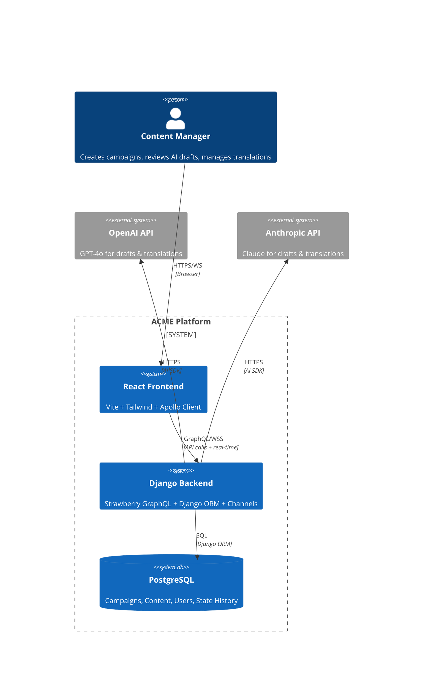
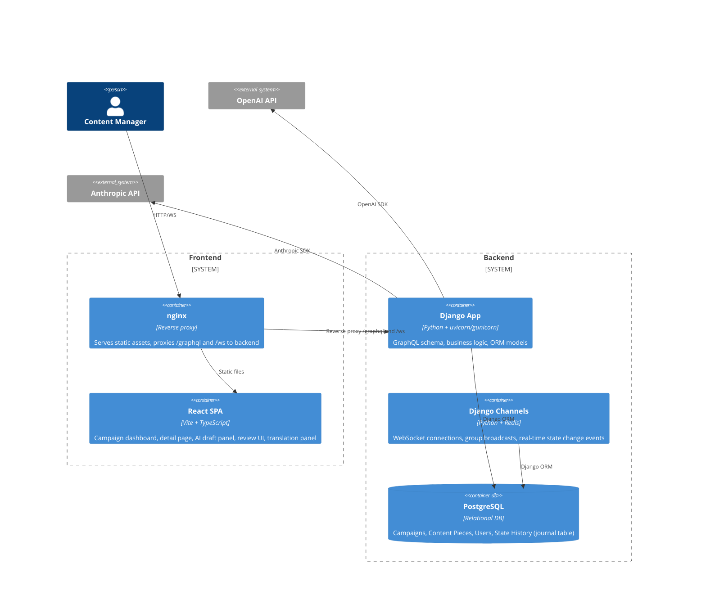
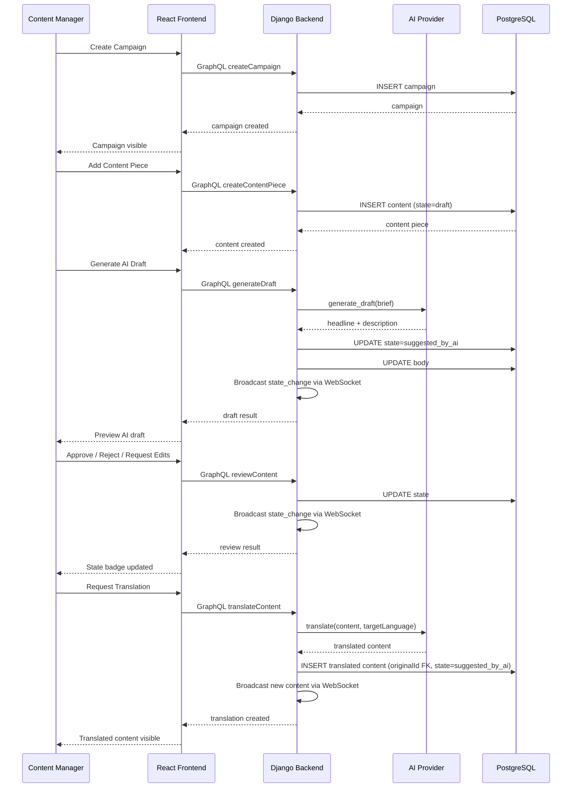

# ACME Content Workflow — Architecture

## Overview

```
User (Browser)  ───>  React/Vite (Frontend)  ──HTTP/WS──>  Django + Strawberry GraphQL (Backend)  ──SQL──>  PostgreSQL
                                                                │
                                                                ├── OpenAI SDK ──> GPT-4o
                                                                └── Anthropic SDK ──> Claude
```

## System Context



## Container Diagram



## Data Flow — Content Workflow



## Key Architecture Decisions

| Decision | Choice | ADR |
|---|---|---|
| API style | Strawberry GraphQL | ADR-001 |
| AI providers | OpenAI + Anthropic (abstraction layer) | ADR-002 |
| Real-time mechanism | Django Channels WebSockets | ADR-003 |
| Database schema | Django ORM models with migrations | ADR-004 |
| Backend framework | Django + Strawberry GraphQL | ADR-005 |
| Authentication | JWT (PyJWT) with httpOnly cookies, rate limiting, WS origin check | ADR-007, ADR-010 |
| Security controls | Depth limits, CSP, prompt injection guards | ADR-008 |
| Production hardening | mypy strict, CORS multi-origin, XSS sanitization | ADR-010 |

## State Machine

```
[Draft] ──generate AI──> [Suggested by AI]
                              │
                   ┌──────────┴──────────┐
                   ▼                     ▼
              [Reviewed]            [Rejected]
                   │                     │
            ┌──────┼──────┐             │
            ▼      ▼      ▼             │
       [Approved] [Rejected] ─>[Suggested by AI]──┘
                              (re-edit)
```

Valid transitions enforced at model layer via `VALID_TRANSITIONS` map. Invalid transitions raise `ValidationError`.
